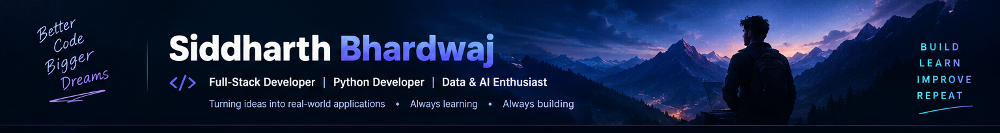

<p align="center">
  <a href="https://github.com/sid1312dharth">
    
  </a>
</p>

<h1 align="center">👨‍💻 Siddharth Bhardwaj</h1>

<h3 align="center"><code>Full-Stack Developer</code> · <code>Python Developer</code> · <code>Data &amp; AI Enthusiast</code></h3>

<p align="center">
  
</p>

<p align="center">
  <a href="https://github.com/sid1312dharth"></a>
  <a href="https://github.com/sid1312dharth"></a>
</p>

---

## 🧠 About Me

I'm a developer who enjoys turning ideas into **real, usable applications**.

I work across frontend, backend, databases, and Python-based development while continuously expanding into **Data Science, Machine Learning, and AI**.

```python
class SiddharthBhardwaj:
    role = "Full-Stack Developer"

    languages = ["Python", "JavaScript", "Java"]

    frontend = [
        "HTML", "CSS", "JavaScript",
        "React", "Tailwind CSS"
    ]

    backend = [
        "Node.js", "Express",
        "Spring Boot"
    ]

    databases = [
        "MongoDB", "PostgreSQL", "MySQL"
    ]

    data_ai = [
        "NumPy", "Pandas",
        "Matplotlib", "Scikit-Learn"
    ]

    currently_learning = [
        "Advanced Python",
        "Data Science",
        "Machine Learning",
        "AI / LLM Applications",
        "Cloud & DevOps"
    ]

    philosophy = "Build → Learn → Improve → Repeat"
```

---

# ⚡ What I Do

<table width="100%">
<tr>
<td width="50%" valign="top">

<h3>🌐 Full-Stack Development</h3>
<p>Building modern web applications with:</p>
<ul>
  <li>React</li>
  <li>JavaScript</li>
  <li>Tailwind CSS</li>
  <li>Node.js</li>
  <li>Express</li>
  <li>REST APIs</li>
  <li>MongoDB</li>
  <li>PostgreSQL</li>
</ul>

</td>
<td width="50%" valign="top">

<h3>🐍 Python &amp; Data</h3>
<p>Exploring the Python ecosystem through:</p>
<ul>
  <li>Python</li>
  <li>NumPy</li>
  <li>Pandas</li>
  <li>Matplotlib</li>
  <li>Data Analysis</li>
  <li>Machine Learning</li>
  <li>AI / LLM Applications</li>
</ul>

</td>
</tr>
</table>

---

# 🚀 Featured Projects

<table width="100%">
<tr>
<td width="50%" valign="top">

<h3>🗂️ Team Task Manager</h3>
<p>A full-stack task management platform for teams, tasks and workflows.</p>
<p><strong>Stack:</strong> <code>React</code> <code>Node.js</code> <code>Express</code> <code>PostgreSQL</code></p>
<p><strong>→</strong> <a href="https://github.com/sid1312dharth/Team-Task-Manager">View Project</a></p>

</td>
<td width="50%" valign="top">

<h3>🛒 E-Commerce</h3>
<p>A modern e-commerce project focused on a clean and practical shopping experience.</p>
<p><strong>Stack:</strong> <code>JavaScript</code> <code>React</code> <code>Tailwind CSS</code></p>
<p><strong>→</strong> <a href="https://github.com/sid1312dharth/ecommerce">View Project</a></p>

</td>
</tr>
<tr>
<td width="50%" valign="top">

<h3>💼 My Portfolio</h3>
<p>Personal developer portfolio showcasing projects, skills and my development journey.</p>
<p><strong>Stack:</strong> <code>HTML</code> <code>CSS</code> <code>JavaScript</code></p>
<p><strong>→</strong> <a href="https://github.com/sid1312dharth/My_Portfolio">View Project</a></p>

</td>
<td width="50%" valign="top">

<h3>🐍 Python Projects</h3>
<p>A growing collection of Python projects and learning experiments.</p>
<p><strong>Stack:</strong> <code>Python</code></p>
<p><strong>→</strong> <a href="https://github.com/sid1312dharth/Python">Explore</a></p>

</td>
</tr>
</table>

---

# 🛠️ Technology Arsenal

### Languages

<p>

</p>

### Frontend

<p>

</p>

### Backend & Databases

<p>

</p>

### Data / AI

<p>
<b>NumPy</b> · <b>Pandas</b> · <b>Matplotlib</b> · <b>Scikit-Learn</b>
</p>

### Tools & Cloud

<p>

</p>

---

# 📊 GitHub Analytics

<p align="center">
  
  
</p>

<p align="center">
  
</p>

---

# 🐍 Contribution Snake

<p align="center">
  
</p>

---

# 🎯 Current Mission

<table width="100%">
<tr>
<td width="50%" valign="top">

<h3>🔥 Building</h3>
<p>Full-stack applications that solve practical problems.</p>

</td>
<td width="50%" valign="top">

<h3>🧠 Learning</h3>
<p>Python, Data Science, Machine Learning &amp; AI.</p>

</td>
</tr>
<tr>
<td width="50%" valign="top">

<h3>⚙️ Improving</h3>
<p>Backend architecture, APIs and databases.</p>

</td>
<td width="50%" valign="top">

<h3>☁️ Exploring</h3>
<p>Cloud deployment, Docker &amp; DevOps.</p>

</td>
</tr>
</table>

---

# 📚 Learning Roadmap

```text
FULL-STACK WEB DEVELOPMENT
        │
        ├── Frontend
        │     ├── React
        │     ├── JavaScript
        │     └── Tailwind CSS
        │
        ├── Backend
        │     ├── Node.js
        │     ├── Express
        │     └── Spring Boot
        │
        └── Databases
              ├── MongoDB
              ├── PostgreSQL
              └── MySQL
                    │
                    ▼
                 PYTHON
                    │
          ┌─────────┼─────────┐
          ▼         ▼         ▼
        NumPy     Pandas   Matplotlib
          └─────────┼─────────┘
                    ▼
              DATA SCIENCE
                    │
                    ▼
            MACHINE LEARNING
                    │
                    ▼
                 AI / LLM
```

---

# 💡 Developer Philosophy

<p align="center">
  <strong>"Don't just learn technologies. Build things with them."</strong><br/><br/>
  <code>BUILD</code> → <code>LEARN</code> → <code>BREAK</code> → <code>FIX</code> → <code>IMPROVE</code> → <code>REPEAT</code>
</p>

---

# 🤝 Let's Connect

<p align="center">
  I'm interested in:<br/><br/>
  <strong>💻 Interesting Projects · 🤝 Collaboration · 🚀 Startup Ideas · 🧠 Learning</strong><br/><br/>
  <a href="https://github.com/sid1312dharth">
    
  </a>
  <a href="https://www.linkedin.com/in/siddharthbhardwaj-softwareengineer/">
    
  </a>
</p>

---

<p align="center">
  <strong>⭐ If you find something useful in my repositories, consider giving it a star.</strong><br/><br/>
  <br/><br/>
  <strong>Building the future one commit at a time. 🚀</strong>
</p>